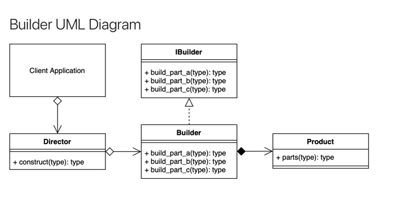

    **Product**: 
                The Product being built.
    **Builder** 
                Interface: The Interface that the Concrete builder should implement.
    **Builder**: 
                Provides methods to build and retrieve the concrete product. Implements the Builder Interface.
    **Director**:
                Has a construct() method that when called creates a customized product using the methods of the Builder.